<div align="center">



[](https://linkedin.com/in/dhanushrameshbabu16)
[](https://github.com/dhanushhhhh01)
[](https://github.com/dhanushhhhh01)
[](https://linkedin.com/in/dhanushrameshbabu16)

</div>

---

## 👨‍💻 About Me

I'm a **Master's student** at **SRH Berlin University of Applied Sciences**, specializing in **Engineering & Sustainable Technology Management (Industry 4.0)**. I build intelligent, connected systems at the intersection of AI, industrial automation, and robotics.

- 🎓 MSc. Engineering & Sustainable Technology Management — SRH Berlin

- - 🏭 Passionate about **Industry 4.0**, **IIoT**, and **AI-driven automation**
 
  - - 🤖 Building **ROS 2** robot systems and **digital twins**
   
    - - 🔁 Automating workflows with **n8n**, **LangChain**, and **LLM APIs**
     
      - - 🎨 Building immersive **3D web experiences** with React, Three.js & GSAP
       
        - - 🔍 Actively seeking **Werkstudent** or **Internship** roles in Berlin
         
          - ---

          ## 🛠️ Tech Stack

          ### Languages
          
          
          
          

          ### Robotics & Simulation
          
          

          ### IoT & Industrial
          
          
          
          
          

          ### AI & Automation
          
          
          
          
          

          ### 3D Web & Frontend
          
          
          
          
          

          ### Data & Monitoring
          
          
          
          

          ### DevOps & Web
          
          
          

          ---

          ## 🚀 Featured Projects

          | Project | Description | Stack |
          |--------|-------------|-------|
          | [🎨 rajesh-portfolio](https://github.com/dhanushhhhh01/rajesh-portfolio/tree/dhanush-portfolio) | Award-worthy 3D portfolio website with WebGL, GSAP animations & Three.js | React, TypeScript, Three.js, GSAP, WebGL |
          | [🏭 industry4-cv-plc-sorting-bridge](https://github.com/dhanushhhhh01/industry4-cv-plc-sorting-bridge) | AI-powered color sorting with OpenCV + PLC/MQTT | Python, OpenCV, MQTT |
          | [🤖 ros2-robot-simulation](https://github.com/dhanushhhhh01/ros2-robot-simulation) | Multi-robot fleet orchestration with ROS 2 & Nav2 | ROS2, Python, Gazebo |
          | [🔁 n8n-ai-workflow-hub](https://github.com/dhanushhhhh01/n8n-ai-workflow-hub) | 12 production n8n workflow automations | n8n, Docker, AI APIs |
          | [🧠 llm-agent-toolkit](https://github.com/dhanushhhhh01/llm-agent-toolkit) | Modular LLM agent framework with RAG & tools | Python, LangChain, OpenAI |
          | [🌐 iiot-gateway-bridge](https://github.com/dhanushhhhh01/iiot-gateway-bridge) | OPC-UA/MQTT/Modbus edge-to-cloud gateway | Python, InfluxDB, Docker |
          | [🔥 thermal-predictive-twin](https://github.com/dhanushhhhh01/thermal-predictive-twin) | ML-based thermal failure prediction digital twin | Python, LSTM, FastAPI |
          | [🛠️ python-automation-scripts](https://github.com/dhanushhhhh01/python-automation-scripts) | 20+ automation scripts for data, web & industrial | Python, MQTT, Slack |
          | [📊 smart-factory-dashboard](https://github.com/dhanushhhhh01/smart-factory-dashboard) | Real-time factory KPI dashboard with OEE, downtime & n8n alerts | Python, MQTT, Grafana, Docker |
          | [🗣️ ros2-llm-voice-robot](https://github.com/dhanushhhhh01/ros2-llm-voice-robot) | ROS 2 robot controlled via natural language LLM commands | ROS2, LangChain, Ollama, Nav2 |
          | [⚙️ predictive-maintenance-api](https://github.com/dhanushhhhh01/predictive-maintenance-api) | Production-ready FastAPI for LSTM-based failure prediction | Python, FastAPI, LSTM, Docker |
          | [☁️ iiot-azure-pipeline](https://github.com/dhanushhhhh01/iiot-azure-pipeline) | Edge-to-Azure IoT Hub pipeline with device twin management | Python, Azure IoT, MQTT, Docker |
          | [🤖 industrial-ai-agent](https://github.com/dhanushhhhh01/industrial-ai-agent) | LLM agent that monitors n8n workflows & auto-diagnoses failures | Python, LangGraph, n8n API, Ollama |

          ---

          ## ✨ Contribution Activity

          <div align="center">
          
          <br/>
          
          <br/>
          
          </div>div>

          ---

          ## 📚 Currently Learning

          ```python
          currently_learning = {
              "robotics": ["ROS 2 Advanced Navigation", "Multi-Robot SLAM", "Gazebo Harmonic"],
              "ai_agents": ["LangGraph", "CrewAI", "Agentic RAG Pipelines"],
              "industrial": ["IEC 61131-3 PLC", "Azure IoT Hub", "Edge AI Deployment"],
              "frontend_3d": ["Three.js Shaders", "WebGL GLSL", "React Three Fiber Advanced"],
              "certifications": ["AWS Cloud Practitioner", "ROS 2 Navigation"]
          }
          ```

          ---

          ## 📬 Get In Touch

          <div align="center">

          🟢 **I am actively looking for Werkstudent or Internship opportunities in Berlin!**

          If you're working on anything in **Industry 4.0**, **AI Automation**, **Robotics**, or **IIoT** — let's connect!

          [](https://linkedin.com/in/dhanushrameshbabu16)
          [](mailto:dhanushr.3504@gmail.com)

          ---

          

          </div>
